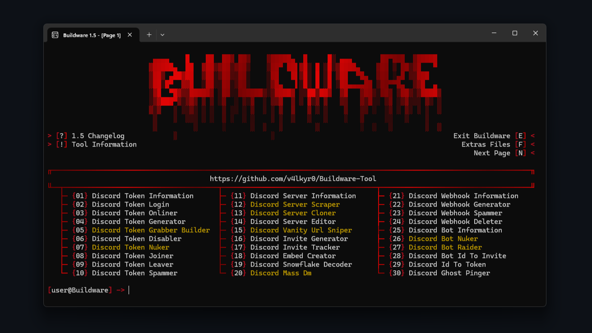
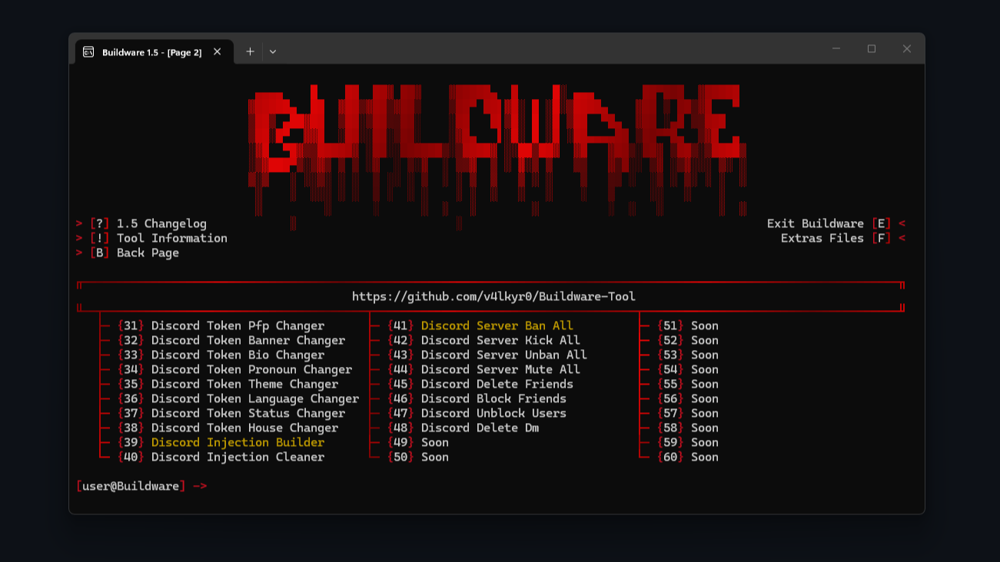

<div align="center">

#  Buildware-Tool 

<p>
  <strong>All-in-one Discord utility suite for tokens, webhooks & bots</strong>
</p>

<p>


</p>




</div>

<br>

---

## Warning

**DO NOT** download Buildware-Tool from unofficial sources. **Only use** this official Github repository to avoid malware, scams, or compromised versions. 

<br>

---

## About

**Buildware-Tool** is a Discord API Tool created by **myself (v4lkyr0)**. It comes with many features for **tokens, webhooks, bots**, and more. **All in one place**! The tool works on **Windows & Linux**, and you don't have to worry about **malware or any other bad stuff**. Buildware-Tool will be **updated regularly**, so stay tuned and **enjoy**! :D

<br>

---

## Features

```yaml
- Changelog        : Displays the change history.
- Exit Buildware   : Exits the tool.
- Tool Information : Displays information about the tool.
- Extras File      : Opens Config file and Extras folder.
- Next Page        : Navigate to the next page of features.
- Back Page        : Navigate to the previous page of features.
```

```yaml
- Discord Token Information     : Displays sensitive information about a token.
- Discord Token Login           : Log in to Discord using a token.
- Discord Token Onliner         : Set a token's status to online.
- Discord Token Generator       : Generates random token.
- Discord Token Grabber Builder : Builds a token grabber executable [⭐]
- Discord Token Disabler        : Disables a token.
- Discord Token Nuker           : Performs destructive actions on the account [⭐]
- Discord Token Joiner          : Makes a token join a server.
- Discord Token Leaver          : Makes a token leave a server.
- Discord Token Spammer         : Sends mass messages in a channel.
- Discord Server Information    : Shows detailed information about a server.
- Discord Server Scraper        : Scrapes members from a server [⭐]
- Discord Server Cloner         : Clones a server's structure and settings [⭐]
- Discord Server Editor         : Edits server settings and configuration.
- Discord Vanity Url Sniper     : Snipes custom vanity URLs [⭐]
- Discord Invite Generator      : Generates server invitations.
- Discord Invite Tracker        : Tracks invitations and their usage.
- Discord Embed Creator         : Creates custom Discord embeds.
- Discord Snowflake Decoder     : Decodes a Discord ID.
- Discord Mass Dm               : Sends mass private messages [⭐]
- Discord Webhook Information   : Shows information about a webhook.
- Discord Webhook Generator     : Generates webhooks.
- Discord Webhook Spammer       : Spams a webhook with messages.
- Discord Webhook Deleter       : Deletes a webhook.
- Discord Bot Information       : Shows detailed information about a bot.
- Discord Bot Nuker             : Performs destructive actions via a bot [⭐]
- Discord Bot Raider            : Uses a bot to raid servers [⭐]
- Discord Bot Id To Invite      : Gets an invitation link from a bot's ID.
- Discord Id To Token           : Tries to brute force from a user ID.
- Discord Ghost Pinger          : Sends mentions users and deletes them instantly.
- Discord Token Pfp Changer     : Changes the account's profile picture.
- Discord Token Banner Changer  : Changes the account's banner.
- Discord Token Bio Changer     : Changes the account's bio.
- Discord Token Pronoun Changer : Changes the account's pronouns.
- Discord Token Theme Changer   : Changes Discord's theme.
- Discord Token Status Changer  : Changes the custom status of the account.
- Discord Token House Changer   : Changes the HypeSquad house of the account.
- Discord Injection Builder     : Builds a Discord injection [⭐]
- Discord Injection Cleaner     : Cleans Discord injection files.
- Discord Server Ban All        : Bans all members from a server [⭐]
- Discord Server Kick All       : Kicks all members from a server.
- Discord Server Unban All      : Unbans all banned members from a server.
- Discord Server Mute All       : Mutes all members in a server.
- Discord Delete Friends        : Deletes all friends from the account.
- Discord Block Friends         : Blocks all friends from the account.
- Discord Unblock Users         : Unblocks all blocked users.
- Discord Delete Dm             : Deletes all private messages.
```

<br>

---

## Installation

Download the latest Buildware-Tool version [here](https://github.com/v4lkyr0/Buildware-Tool/archive/refs/heads/Buildware-Tool.zip)

<p>

```
1. Download the .zip folder.
2. Unzip the folder.
3. Run "Setup.py".
4. Enjoy!
```
**Or via Git:**
```
1. Open a terminal.
2. Type: git clone https://github.com/v4lkyr0/Buildware-Tool.git
3. Type: cd Buildware-Tool
4. Type: git pull
5. Type: "python Setup.py" or "python3 Setup.py"
6. Enjoy!
```

<br>

---

## Requirements

- **Python 3.8 or higher.**
- **Windows or Linux OS.**
- **Internet connection.**

<br>

## Donation

```yaml
- Ethereum : 0xef1d65ff652e9087ebd7af400122caebb35fdf2b
- Solana   : EqVkGSpgj2DZHN9wkKqzG9zTTiaQmMpkSuLeBynqLzbj
```

<br>

---

## Disclaimer

> **Buildware-Tool is strictly for educational & security research purposes.**
>
> - Use this tool **only on your own** token, bots, webhooks & servers.
> - Any malicious or unauthorized use is **prohibited & illegal**.
> - I am **not responsible** for misuse.

---

<div align="center">
  <p>Made with <3 by <a href="https://github.com/v4lkyr0">v4lkyr0</a></p>
</div>