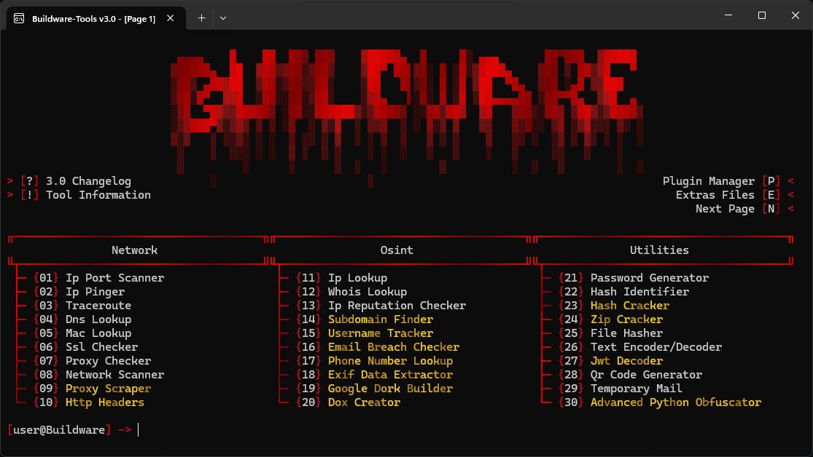
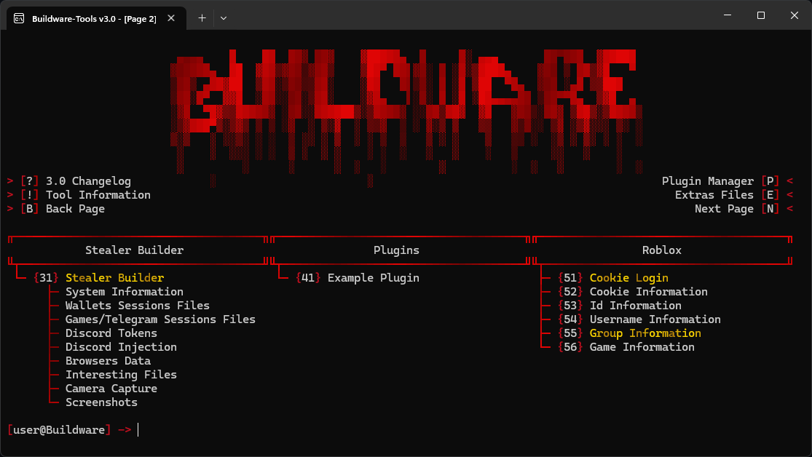
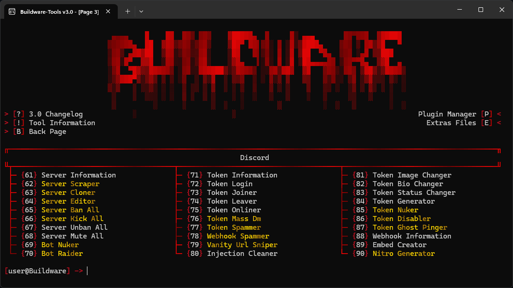

<div align="center">

<h1 align="center">
   Buildware-Tools
</h1>

<p>


</p>

<div align="center">
  
  
</div>

<div align="center">
  
</div>

</div>

<br>

---

## 💖 Support

If you like **Buildware-Tools** and want to support the project, you can leave a star on the repository. It helps a lot and shows interest for future updates.

<div align="center">
  
</div>

<br>

---

## ⚠️ Warning

**DO NOT** download Buildware-Tools from unofficial sources. **Only use** this official GitHub repository to avoid malware, scams, or compromised versions.

<br>

---

## 📌 About

**Buildware-Tools** is a powerful multitool built by **v4lkyr0 (myself)**, designed to handle everything from **Discord automation** and **OSINT reconnaissance** to **network diagnostics**, **cryptography utilities**, and **Roblox lookups** — all from a single terminal interface. It works natively on **Windows & Linux**, requires no external setup beyond Python, and is **regularly updated** with new features and improvements.

<br>

---

## ✨ Features

> Features marked with `[⭐]` are the **most powerful** and require a **GitHub star to unlock**.

> Features marked with `[🔧]` are **currently under testing** and will **not be available**.

```
🛠️ Buildware-Tools
│
├── 🗺️ Navigation (6)
│   │
│   ├── Changelog                       : Displays the change history
│   ├── Plugin Manager                  : Manage and install community-made plugins
│   │   ├── Install Plugin              : Install a plugin from a GitHub repository url
│   │   └── Manage Plugins              : Show/Hide, update or uninstall installed plugins
│   │
│   ├── Tool Information                : Displays information about the tool
│   ├── Extras File                     : Opens Config file and Extras folder
│   │   ├── Data File                   : Opens the tool's configuration JSON file
│   │   └── Extras Folder               : Opens the Extras folder in your file explorer
│   │
│   ├── Next Page                       : Navigate to the next page of features
│   └── Back Page                       : Navigate to the previous page of features
│
├── 🌐 Network (10)
│   │
│   ├── Ip Port Scanner                 : Scans open ports on a target host
│   ├── Ip Pinger                       : Pings a target host and measures response time
│   ├── Traceroute                      : Traces the route packets take to a target host
│   ├── Dns Lookup                      : Retrieves DNS records for a domain
│   ├── Mac Lookup                      : Identifies the vendor of a Mac address
│   ├── Ssl Checker                     : Retrieves and displays SSL certificate information
│   ├── Proxy Checker                   : Tests if a proxy is valid and retrieves its IP
│   ├── Network Scanner                 : [⭐] Scans all active hosts on a local network
│   ├── Proxy Scraper                   : [⭐] Scrapes thousands of proxies from public sources
│   └── Http Headers                    : [⭐] Retrieves and analyzes HTTP headers of a website
│
├── 🔍 Osint (10)
│   │
│   ├── Ip Lookup                       : Retrieves geolocation and ISP information for an IP
│   ├── Whois Lookup                    : Retrieves Whois registration data for a domain
│   ├── Ip Reputation Checker           : Checks if an IP is blacklisted across DNS blacklists
│   ├── Subdomain Finder                : [⭐] Discovers subdomains of a target domain
│   ├── Username Tracker                : [⭐] Searches for a username across 40+ platforms
│   ├── Email Breach Checker            : [⭐] Checks if an email has been found in data breaches
│   ├── Phone Number Lookup             : [⭐] Retrieves carrier, country and timezone for a phone number
│   ├── Exif Data Extractor             : [⭐] Extracts metadata and GPS coordinates from images
│   ├── Google Dork Builder             : [⭐] Builds and executes advanced Google search queries
│   └── Dox Creator                     : [⭐] Creates a complete profile document by compiling available information about a target
│
├── 🧰 Utilities (10)
│   │
│   ├── Password Generator              : Generates a secure random password
│   ├── Hash Identifier                 : Identifies the type of a hash based on its length
│   ├── Hash Cracker                    : [⭐] Cracks hashes using a wordlist
│   ├── Zip Cracker                     : [⭐] Cracks password-protected zip files using a wordlist
│   ├── File Hasher                     : Computes MD5, SHA1, SHA256 and SHA512 hashes of a file
│   ├── Text Encoder/Decoder            : Encodes and decodes text in Base64, Url, Html, Hex and Binary
│   ├── Jwt Decoder                     : [⭐] Decodes and displays the header and payload of a JWT token
│   ├── Qr Code Generator               : Generates a QR code image from any data
│   ├── Temporary Mail                  : Creates a temporary email and checks its inbox
│   └── Advanced Python Obfuscator      : [⭐] Obfuscates Python code using multiple advanced techniques
│
├── 🔐 Stealer (1)
│   │
│   └── Stealer Builder                 : [⭐] Generates a custom stealer with selected modules
│       └── Features
│           ├── System Information      : Detailed system information
│           ├── Wallets Sessions Files  : Crypto wallet sessions/files
│           ├── Games Sessions Files    : Game launcher sessions
│           ├── Telegram Sessions Files : Telegram Desktop sessions
│           ├── Discord Tokens          : Discord tokens from clients & browsers
│           ├── Discord Injection       : Persistent injection into Discord clients
│           ├── Browser Passwords       : Saved passwords
│           ├── Browser Cookies         : Browser cookies
│           ├── Browser History         : Browsing history
│           ├── Browser Downloads       : Download history
│           ├── Browser Extensions      : Installed extensions, files and manifests
│           ├── Interesting Files       : Sensitive files
│           ├── Camera Capture          : Webcam snapshot
│           ├── Screenshot              : Full-screen screenshot
│           └── Ping On Discord         : Ping @everyone in the webhook on report
│
├── 🧩 Plugins (1)
│   │
│   └── Example Plugin                  : Built-in plugin template and development guide for creating your own plugins
│
├── 🎮 Roblox (6)
│   │
│   ├── Cookie Login                    : [⭐] Log in to Roblox using a cookie via browser
│   ├── Cookie Information              : Displays detailed account info from a cookie
│   ├── Id Information                  : Looks up a Roblox user by their ID
│   ├── Username Information            : Looks up a Roblox user by their username
│   ├── Group Information               : [⭐] Shows detailed information about a Roblox group
│   └── Game Information                : Shows detailed information about a Roblox game
│
└── 👾 Discord (30)
    │
    ├── Server
    │   ├── Server Information          : Shows detailed information about a server
    │   ├── Server Scraper              : [⭐] Scrapes members, channels and roles from a server
    │   ├── Server Cloner               : [⭐] Clones a server's structure, channels and roles
    │   ├── Server Editor               : [⭐] Edits server settings and configuration
    │   ├── Server Ban All              : [⭐] Bans all members from a server
    │   ├── Server Kick All             : [⭐] Kicks all members from a server
    │   ├── Server Unban All            : Unbans all banned members from a server
    │   └── Server Mute All             : Mutes all members in a server
    │
    ├── Bot
    │   ├── Bot Nuker                   : [⭐] Performs destructive actions on a server via a bot
    │   └── Bot Raider                  : [⭐] Spams messages across all channels via a bot
    │
    ├── Token
    │   ├── Token Information           : Displays sensitive information about a token
    │   ├── Token Login                 : Log in to Discord using a token via browser
    │   ├── Token Joiner                : Makes a token join a server
    │   ├── Token Leaver                : Makes a token leave a server
    │   ├── Token Onliner               : Sets a token's status to online via gateway
    │   ├── Token Mass Dm               : [⭐] Sends mass private messages to all DMs
    │   ├── Token Spammer               : [⭐] Sends mass messages in a channel
    │   ├── Token Ghost Pinger          : [⭐] Sends mentions and deletes them instantly
    │   ├── Token Nuker                 : [⭐] Performs destructive actions on the account
    │   ├── Token Disabler              : [⭐] Disables a token permanently
    │   ├── Token Image Changer         : Changes the account's profile picture or banner
    │   ├── Token Bio Changer           : Changes the account's bio
    │   ├── Token Status Changer        : Changes the custom status of the account
    │   └── Token Generator             : Generates and checks random tokens
    │
    ├── Webhook
    │   ├── Webhook Spammer             : [⭐] Spams a webhook with messages
    │   └── Webhook Information         : Shows detailed information about a webhook
    │
    └── Other
        ├── Embed Creator               : Creates and sends custom Discord embeds
        ├── Injection Cleaner           : Detects and removes Discord client injections
        ├── Vanity Url Sniper           : [⭐] Monitors and snipes custom vanity URLs
        └── Nitro Generator             : [⭐] Generates and checks random Nitro codes
```

<br>

---

## 📦 Installation

Download the latest version [here](https://github.com/v4lkyr0/Buildware-Tools/archive/refs/heads/Buildware-Tools.zip)

```
1. Download the .zip folder.
2. Unzip the folder.
3. Run "Setup.py".
4. Enjoy!
```

**Or via Git:**

```
git clone https://github.com/v4lkyr0/Buildware-Tools.git
cd Buildware-Tools
python Setup.py
```

<br>

---

## 📋 Requirements

- **Python 3.8 or higher.**
- **Windows, Linux & MacOS.**
- **Internet connection.**

<br>

---

## 📈 Star History


---

## 💸 Donation

```yaml
- Ethereum : 0xef1d65ff652e9087ebd7af400122caebb35fdf2b
- Solana   : EqVkGSpgj2DZHN9wkKqzG9zTTiaQmMpkSuLeBynqLzbj
```

<br>

---

## ⚖️ Disclaimer

> **Buildware-Tools is strictly for educational & security research purposes.**
>
> - Use this tool **only on yourself**.
> - Any malicious or unauthorized use is **prohibited & illegal**.
> - I am **not responsible** for misuse.

<br>

---

<div align="center">
  <p>Made with <3 by <a href="https://github.com/v4lkyr0">v4lkyr0</a></p>
</div>